# Beaver's Gamepads

## Description
This module is intended to be used in local sessions with one Map Monitor and multiple connected gamepads.
Initially this module comes with a collection of submodules that let you choose an actor and gives you control over that token move and rotation.

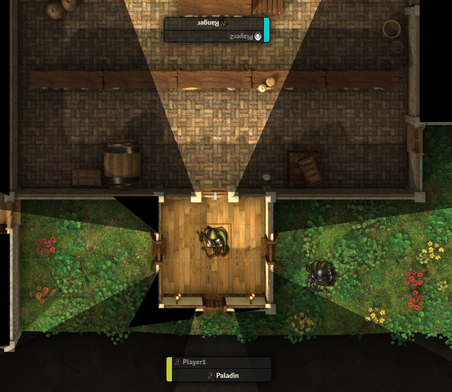

### GamepadModules
beavers-gamepad is Built as Framework to host submodules named GamepadModules.
GamepadModules then assignes actions to axes or buttons.
Initially at least four GamepadModules are available 
- "Beaver's Token movement" which allows to move a token around.
- "Beaver's Token rotation" which allows to rotate a token.
- "Activate Tiny-User-Interface" which activates a user Context menu.
- "Conroll Tiny-User-Interfacet" which controls the tiny-user-interface.

### TinyUIModules
Tiny-User-Interface is also built as Framework to host submodules names TinyUIModules.
TinyUIModules allow simple interactions with the user.
beavers-gamepad provide at least one module:
- "Beavers Character Selection" with this context you can choose and select another actor to control.

## How To
### Example UserManagement
For each player on your table add a new user to your game and one additional user Map:
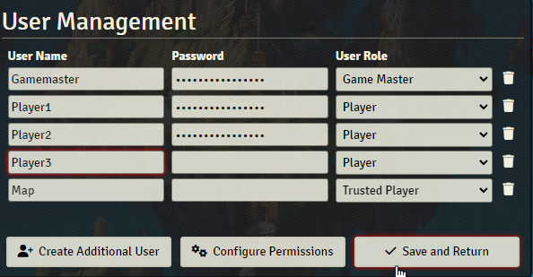

Give each player ownership to at least one actor and give the Map user ownership for all such actors:

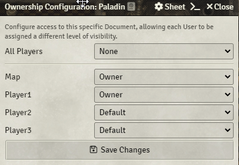

_If you assign multiple actors to a user the user can later decide whom to play._

Go to your common display and login as map user.
### Gamepad Settings
Connect your gamepads to the client that shows the common display. 

_You need to go to the module Settings "Beaver's Gamepad" underneath "Configure Settings" you won't find it in the "Configure Controls" of foundry as it is not only a key binding._

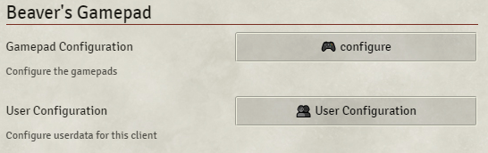

Here you can press the 🎮configure button:

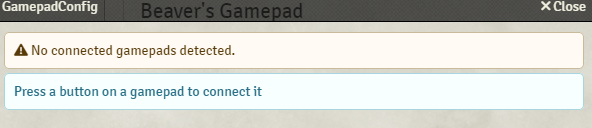

_If no gamepads are detected you need to connect you gamepad to your device and then press any Key on your gamepads._

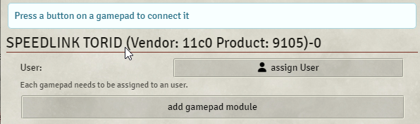

_All connected Gamepads will be listed with its internal identification._

Now you should assign each gamepad to a different user e.g. (player 1-n)

Then you can add gamepadModules to this controller

_The amount of GamepadModules can vary depending on vtt-modules installed.
Other VTT-modules can add own gamepad-modules here if they implement the interface and register that gamepadmodule._

_Initially there are at least three modules you should add:_
- _Beavers-Token-Movement (moves a token around)_
- _Tiny-User-Interface Control (controls a user defined context)_
- _Tiny-User-Interface Activation (activates the tiny user interface)_

You should add all 3 Modules Each module comes with its own configuration
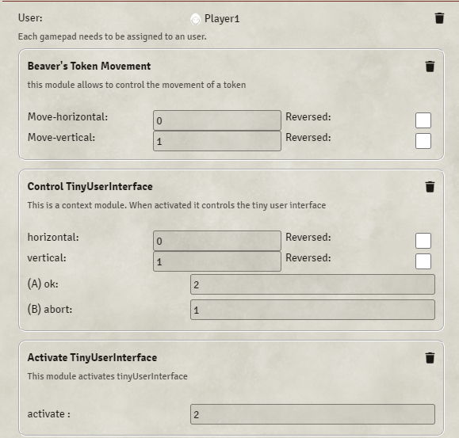

_In each configuration Section you can configure which axis and what buttons to use._
_The current version of beavers-gamepad has only a very primitive settings ! you need to figure out your gamepads internal axis and button numeration._

Luckily most of the time the default config should match and you need no further configuration.
_e.g. Beavers Token Movement should use your lefthand stick of your controller

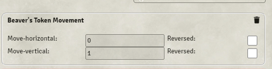

### User Context
In the gamepad Settings you can click the UserConfiguration button
Then add a user configuration for each player.

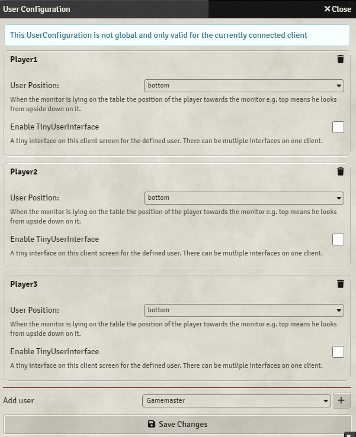
#### User Position:
You can define the user position relative to your common display. 

_If your display lays flat on the table a user may sit top meaning he would look from upside down on the screen. Some modules may consider this to invert axis on your gamepade accordingly e.g. Token Movement._

#### TinyUserInterface:
You should enable the TinyUserInterface for each player.
_This will show a tiny ui that points into the direction the player is sitting. Foundry assigns each user a color the tiny uis have a border in that color. You can drag and drop the ui by this border._

### TinyUIModules
The tinyUI can be activated with the activation button defined in the settings default it should be the (A) button.

_When activated it glows in the color of that user this will deactivate all other modules except the control module for this UI._

You can then select a TinyUIModule.
_The amount of TinyUIModules can vary depending on vtt-modules installed.
Other VTT-modules can add own gamepad-ui-modules here if they implement the interface and register that ui-module._

_Initially there is at least one module available:_
- _Beavers-Character-Selection (you can select another actor for your user that you then control)_

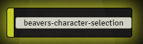

#### Beavers-Character-Selection
Lets you select and choose a new actor for your user. For this to work a gm needs to be connected to the game.

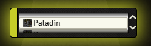

### Done
You should select an actor for you user that you can then control.
Either the user can do this with its gamepad as described via the tinyUIModule "Beavers-Character-Selection".
Or a gamemaster can do this by editing the global user-configuration of vtt-foundry.

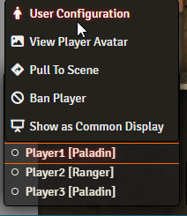

After Setting everything up i usually us Monks Common Display module and activate it on my map user to get rid of any other ui components.

## Limitations
### Detect Gamepads Missing
This module depends on the browsers ability to detect gamepads, i can not do much about it.
- I have observed that on some windows machine some of my controllers are not detected correctly.
  - you may try upgrade the drivers or redeploy the gamepads to different usb ports.
- I have observed that not all Gamepads are registered as Gamepads in windows e.g. steamGamepad is registered as Mouse.
  - There are some thirdparty tools that can change how a gamepad registers to windows. (not part of this documentation)
- I have observed that some gamepads are missing if they are already bound in another app e.g. game.
  - turn of other apps that uses gamepads and refresh the browser.
### Linking phyisical Gamepad to Configuration
- I have observed that it is currently hard to know which axes number correlates to what on your gamepad.
  - I hope that i can find the time to implement some sort of "detect axes" by using the physicall gamepad.
  - You can use https://3960.org/sandbox/gamepad-test.html to find the appropriate numeration.
- I have observed that it is hard to map a gamepad identification name to the real gamepad especially if you have multiple same gamepads.
  - I hope that I can find the time to fix that somehow. 

## Extensions
You can write own GamepadModules or TinyUiModules. There will be a section on how to do this as soon as the interfaces are more established. Currently everything might still be in the flow.

