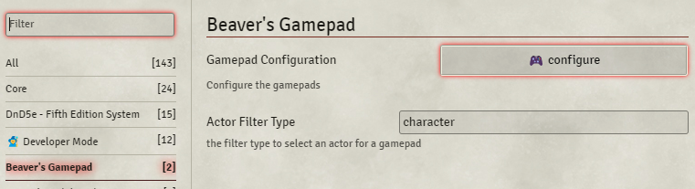
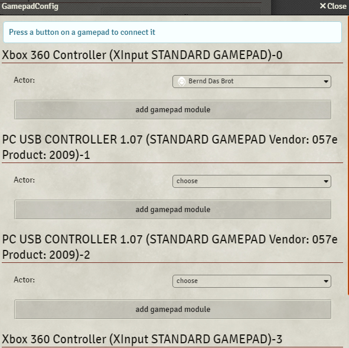

# Beaver's Gamepads

## Description
This module is intended to be used in local sessions with one Map Monitor and multiple connected gamepads.
Each gamepad can be assigned to an actor.

You can add GamepadModules to a gamepad and configure them. 
Initially at least one GamepadModule is available "Beaver's Token movement" which allows to move the actors token around.

## How To
You need to configure your controlls on the client you connect the gamepads to.
You need to go to the module Settings "Beaver's Gamepad" underneath "Configure Settings" you won't find it in the "Configure Controls" of foundry as it is not a key binding.

Here you can press the confiugre button:

If no gamepads are detected you need to connect you gamepad to your device and then press any Key.

All connected Gamepads will be listed with it's internal identification.
Now you can select any actor you want to control with a gamepad. This is limited to the type specified in the previous settings default only character actor.
Then you can add a gamepadModule to this controller:

For now I have only written one gamepadModule which is beavers-token-movemnt. 
- It uses 2 Axes per default axes 0,1 which is mostlikly the lefthand stick of your controller.
- You can reverse axes when your monitor is laying on the table flat and some of your player look at it from upsidedown side.

## Limitations
### Detect Gamepads Missing
This module depends on the browsers ability to detect gamepads, i can not do much about it.
- I have observed that on some windows machine some of my controllers are not detected correctly.
  - you may try upgrade the drivers or redeploy the gamepads to diffrent usb ports.
- I have observed that not all Gamepads are registered as Gamepads in windows e.g. steamGamepad is registered as Mouse.
  - There are some thirdparty tools that can change how a gamepad registers to windows. (not part of this documentation)
- I have observed that some gamepads are missing if they are already bound in another app e.g. game.
  - turn of other apps that uses gamepads and refresh the browser.
### Linking phyisical Gamepad to Configuration
- I have observed that it is currently hard to know which axes number correlates to what on your gamepad.
  - I hope that i can find the time to implement some sort of "detect axes" by using the physicall gamepad.
- I have observed that it is hard to map a gamepad identification name to the real gamepad especially if you have multiple same gamepads.
  - I hope that i can find the time to fix that somehow. 

## Addon
You can write Addons a.k.a GamepadModules. There will be soon a section on how to do this.
