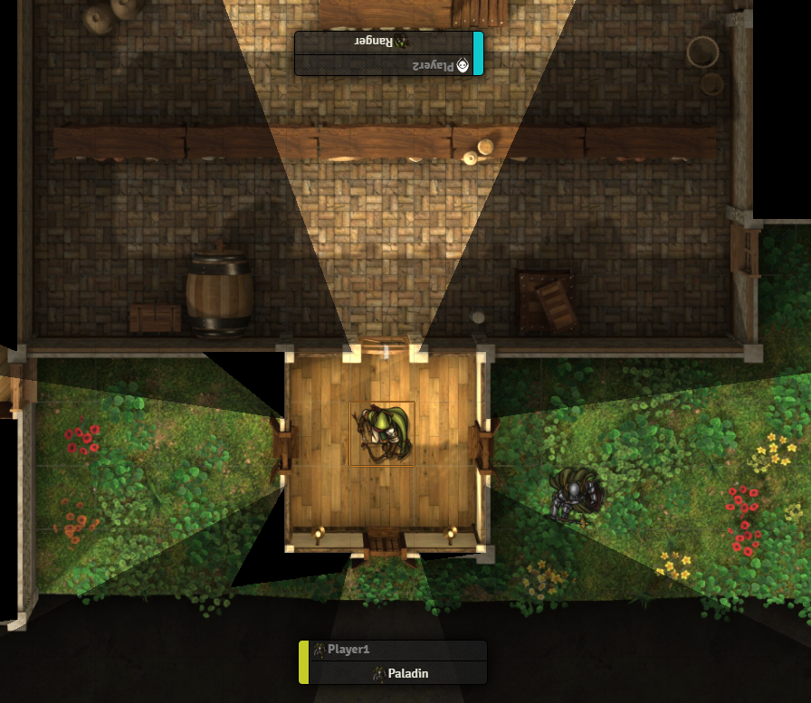
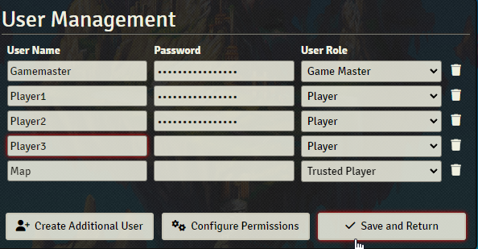
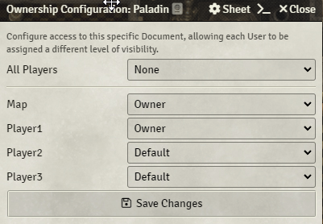
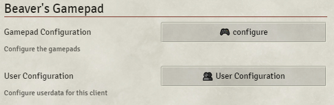
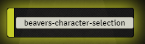
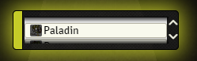
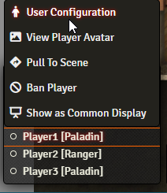

# Beaver's Gamepads

## Requirements
Foundry VTT 13 or 14. No other modules are required.

## Description
This module is intended to be used in local sessions with one Map Monitor and multiple connected gamepads.
Initially this module comes with a collection of submodules that let you choose an actor and gives you control over that token move and rotation.

### GamepadModules
beavers-gamepad is built as framework to host submodules named GamepadModules.
GamepadModules then assignes actions to axes or buttons.
beavers-gamepad provides at least five GamepadModules:
- "Beaver's Token movement" which allows to move a token around.
- "Beaver's Token rotation" which allows to rotate a token.
- "Beavers open doors" open nearest door in close range same as in tinyUIModule
- "Activate Tiny-User-Interface" which activates a user Context menu.
- "Conroll Tiny-User-Interfacet" which controls the tiny-user-interface.

### TinyUIModules
Tiny-User-Interface is also built as framework to host submodules named TinyUIModules.
TinyUIModules allow simple interactions with the user.
beavers-gamepad provides at least two TinyUIModules:
- "Beavers Character Selection" with this context you can choose and select another actor to control.
- "Beavers open doors" open nearest door in close range. When token is allowed to rotate e.g. LockArtWorkRotation is not enabled it will only detect doors in front arc. Works best if the initial token uses a top down image that is facing to the bottom.

## How To
### Example UserManagement
For each player on your table add a new user to your game and one additional user Map:

Give each player ownership to at least one actor and give the Map user ownership for all such actors:

_If you assign multiple actors to a user the user can later decide whom to play._

Go to your common display and login as map user.
### Gamepad Settings
Connect your gamepads to the client that shows the common display.

_You need to go to the module Settings "Beaver's Gamepad" underneath "Configure Settings" you won't find it in the "Configure Controls" of foundry as it is not only a key binding._

Here you can press the "Configure gamepads" button.

_If no gamepads are detected you need to connect your gamepad to your device and then press any button on it._

All connected gamepads are listed with their internal identification.
_The name of a gamepad lights up while one of its buttons is held down, so you can tell which entry belongs to the gamepad in your hands. Gamepads that support it also rumble when you click the icon next to the name._

Now assign each gamepad to a different user e.g. (player 1-n) and choose where that player sits. That is all that is needed:

- _A gamepad that is seen for the first time already comes with the five gamepad modules of this module:_
  - _Beavers-Token-Movement (moves a token around)_
  - _Beavers-Token-Rotation (rotates a token)_
  - _Tiny-User-Interface Activation (activates the tiny user interface)_
  - _Tiny-User-Interface Control (controls a user defined context)_
  - _Beavers-Open-Doors (opens nearest door in close range)_
- _The user of a gamepad gets a Tiny-User-Interface on this screen._

_The amount of GamepadModules can vary depending on vtt-modules installed.
Other VTT-modules can add own gamepad-modules here if they implement the interface and register that gamepadmodule. You can remove modules from a gamepad and add them again._

#### Sticks and buttons
Each gamepad module lists the sticks and buttons it uses. Most of the time the default config matches a standard gamepad and you need no further configuration,
_e.g. Beavers Token Movement uses the left stick of your controller._

If it does not match you do not need to know how your gamepad numbers its sticks and buttons:
- click **detect** next to a stick or button and then press that button, or push that stick, on the gamepad. For sticks the direction you are asked to push to also sets "reversed".
- the wand icon in the title of a gamepad module walks through all sticks and buttons of that module one after the other.
- a row lights up while its button or stick is in use, so you can check the result right away.

_While a detection is running the gamepad does not control anything in the game._

_A second gamepad of a model you already configured starts with the same sticks and buttons._

### User Context
In the module Settings you can click the "Configure users" button.
Users that got a gamepad assigned are listed here already, you can add further users.

#### Seat:
You can define the user position relative to your common display. This is the same setting as the seat in the gamepad configuration.

_If your display lays flat on the table a user may sit top meaning he would look from upside down on the screen. Sticks and the Tiny-User-Interface are turned accordingly._

#### TinyUserInterface:
Every user listed here has a TinyUserInterface on this screen.
_This is a tiny ui that points into the direction the player is sitting. Foundry assigns each user a color the tiny uis have an edge in that color. You can drag and drop the ui by this edge, or type in its position, or center it at the seat of the user._

### TinyUIModules
The tinyUI can be activated with the activation button defined in the settings default it should be the (A) button.

_When activated it glows in the color of that user this will deactivate all other modules except the control module for this UI._

You can then select a TinyUIModule.
_The amount of TinyUIModules can vary depending on vtt-modules installed.
Other VTT-modules can add own gamepad-ui-modules here if they implement the interface and register that ui-module._

_Initially there are two modules available:_
- _Beavers-Character-Selection (you can select another actor for your user that you then control)_
- _Beavers-Open-Door (opens or closes the nearest door in front of your token)_

#### Beavers-Character-Selection
Lets you select and choose a new actor for your user. For this to work a gm needs to be connected to the game, unless the client itself is logged in as that user or as gm.

### Done
You should select an actor for you user that you can then control.
Either the user can do this with its gamepad as described via the tinyUIModule "Beavers-Character-Selection".
Or a gamemaster can do this by editing the global user-configuration of vtt-foundry.

After Setting everything up i usually us Monks Common Display module and activate it on my map user to get rid of any other ui components.

## Limitations
### Detect Gamepads Missing
This module depends on the browsers ability to detect gamepads, i can not do much about it.
- I have observed that on some windows machine some of my controllers are not detected correctly.
  - you may try upgrade the drivers or redeploy the gamepads to different usb ports.
- I have observed that not all Gamepads are registered as Gamepads in windows e.g. steamGamepad is registered as Mouse.
  - There are some thirdparty tools that can change how a gamepad registers to windows. (not part of this documentation)
- I have observed that some gamepads are missing if they are already bound in another app e.g. game.
  - turn of other apps that uses gamepads and refresh the browser.
### Linking physical Gamepad to Configuration
- Gamepads of the same model report the same identification, so the list can not tell them apart by name.
  - The name of a gamepad lights up in the gamepad configuration while one of its buttons is held down, and gamepads that support it can be made to rumble with the icon next to their name.
- The browser numbers the gamepads in the order they wake up. A gamepad that shows up under another number takes its configuration with it, two gamepads of the same model may swap their users though.

## Extensions
You can write own GamepadModules or TinyUiModules. There will be a section on how to do this as soon as the interfaces are more established. Currently everything might still be in the flow.

